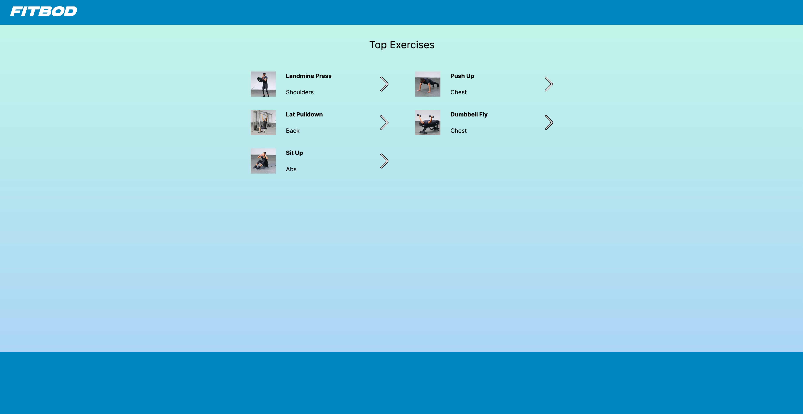
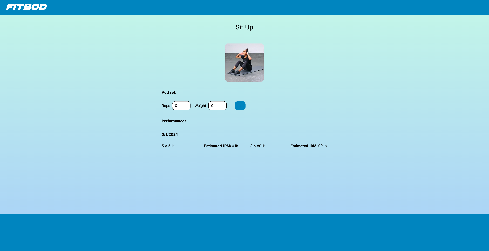

This is a [Next.js](https://nextjs.org/) project bootstrapped with [`create-next-app`](https://github.com/vercel/next.js/tree/canary/packages/create-next-app).

## About the Fitbod App



The Fitbod App allows you to track your progress on your favorite exercises so you can know for sure that your effort is going to getting stronger and more efficient at your most important movements.



## Still to be Added

- Add your favorite workouts to fully customize your dashboard.
- Use AI to encourage you when to progress your movements to avoid plateauing.
- Use AI to find new movements to increase workout variety.

## Getting Started

First, run the development server:

```bash
npm run dev
# or
yarn dev
# or
pnpm dev
# or
bun dev
```

Open [http://localhost:3000](http://localhost:3000) with your browser to see the result.
